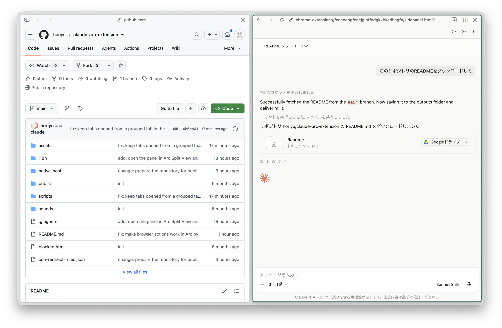

# Claude in Arc

[日本語](#日本語) | [English](#english)

## 日本語

公式の「Claude in Chrome」拡張機能のビルド済みバンドルに，Side Panel API を持たない Arc ブラウザで動作させるための変更を加えた，個人利用向けの非公式ビルドです．Claude のパネルは通常タブとして，または任意で Arc の Split View のペインとして開きます．

> [!WARNING]
> このリポジトリは非公式・実験的なものです．Anthropic，Claude，The Browser Company，Arc とは関係ありません．



左が操作対象のタブ，右が Split View で開いた Claude のパネルです．パネルからの指示で，隣のタブのページを読み取り，操作できます．

## 概要

この拡張機能は，Arc の拡張機能として Claude を開き，ブラウザ内での作業を補助することを目的としています．

主な用途は次の通りです．

- Claude のパネルを通常タブ，または Arc の Split View のペインとして開く
- Claude と会話しながらブラウザ操作を補助する
- タスクのスケジュール実行や通知を利用する
- 必要に応じてファイル操作やダウンロード機能を利用する

## ベースとなる公式拡張機能と変更点

本リポジトリは，公式の「Claude in Chrome」拡張機能（バージョン 1.0.93）のビルド済みバンドルに，Arc 向けの変更を加えたものです．主な変更点は次の通りです．

- Arc に Side Panel API が無いため，サイドパネルの代わりに拡張機能ページを通常タブとして開く
- `Claude in Chrome` 等の表示文言を `Claude in Arc` に置換する
- `declarativeNetRequest` で，`claude.ai/images/*` の応答に CORS ヘッダーを付与し，`claude.ai` の iframe（`sub_frame`）応答から `Content-Security-Policy` ヘッダーを除去する（パネル内で claude.ai を iframe 表示するため）．通常のタブで開いた claude.ai には適用しない
- Arc では `chrome.tabs.group` などタブグループ API の Promise が解決しないため，service worker 内でタブグループを擬似的に実装する（パネルと拡張機能の初期化はタブグループを前提としており，これが無いとブラウザ操作がすべてタイムアウトする）
- 拡張機能の読み込み前から開いていたページには，ページ読み取り用の補助スクリプトを実行時に注入する（公式版では該当ページの再読み込みが必要）
- 任意で，同梱のネイティブホストにより Arc の Split View としてパネルを開く（後述）

バンドル本体（`assets/`，`i18n/`，`sounds/`，`manifest.json` ほかリポジトリ直下のファイル）は，Anthropic が配布する同拡張機能（拡張機能 ID `fcoeoabgfenejglbffodgkkbkcdhcgfn`）の複製であり，本リポジトリの作者はこれらのファイルについて権利を主張しません．バンドルには gif.js や KaTeX フォントなど，それぞれのライセンスに従う第三者製コンポーネントも含まれます．上流との差分は，次節のスクリプトが書き換えるファイル（`manifest.json`，`sidepanel.html`，`managed_schema.json`，`i18n/*.json`，および `assets/` 内の service worker，ツール実行部，表示文言を含むいくつかのチャンク）と，本リポジトリで追加した `cdn-redirect-rules.json`，`native-host/`，`scripts/`，`README.md`，`.gitignore` に限られます．`git-hash.txt` は上流ビルドに含まれるコミットハッシュであり，本リポジトリのものではありません．

## 公式ビルドの更新に追従する手順

公式拡張機能が更新された場合は，Chrome にインストールされた新しいビルド（macOS では `~/Library/Application Support/Google/Chrome/<プロファイル>/Extensions/fcoeoabgfenejglbffodgkkbkcdhcgfn/<バージョン>_0/`．Chrome が生成する `_metadata/` は複製不要）を作業ディレクトリへ複製し，次の 3 つをこの順に実行します．

```
python3 scripts/apply_arc_patches.py <作業ディレクトリ>
python3 scripts/patch_sender_checks.py <作業ディレクトリ>
python3 scripts/rebrand_chrome_strings.py <作業ディレクトリ>
```

1 つ目はマニフェスト，通常タブへのフォールバック，タブグループの擬似実装，補助スクリプトの注入，ネットワークルールを適用します．2 つ目は，サイドパネルを通常タブで代替している Arc 版でも service worker がパネルからのメッセージを受け付けるようにする修正です．3 つ目は，画面に表示される「Chrome」の表記を「Arc」に置き換えます．実行後，本リポジトリのうち `scripts/`，`native-host/`，`README.md`，`.gitignore` 以外を作業ディレクトリの内容で置き換えます（新しいビルドに無くなったファイルは削除します）．

最初の 2 つのスクリプトは minify された識別子を文字列一致で探して書き換えるため，公式ビルド側のコードが変わると `AssertionError` で停止します．その場合はスクリプト内の検索パターンを新しいビルドに合わせて更新してください．3 つ目は見つからない語句を読み飛ばすだけで停止しないため，出力される置換件数を確認し，残った「Chrome」表記があれば語句リストに追加してください．

## 注意事項

この拡張機能は開発者向け・検証用途のものです．公開ストアで配布される一般利用向け拡張機能ではありません．

また，`manifest.json` では以下のような強い権限を要求します（完全な一覧は `manifest.json` の `permissions` を参照してください）．

- `host_permissions: ["<all_urls>"]`
- `debugger`
- `tabs`
- `scripting`
- `downloads`
- `nativeMessaging`
- `declarativeNetRequest`
- `webNavigation`
- `notifications`
- `identity`
- `tabGroups`

これらの権限は，閲覧中のページ情報へのアクセス，ブラウザ操作，ページ遷移の検知，ネットワークルールの適用，通知の表示，ダウンロード，OAuth によるサインイン，外部プロセス連携などに関係します．
内容を理解したうえで，自分の管理下にある環境でのみ利用してください．

## インストール

### 前提条件

- Arc（macOS 版で確認）．拡張機能本体はこれだけで動きます
- claude.ai のアカウント．パネルは有料プランを要求します
- Split View 連携を使う場合は macOS と，Arc から見える場所にある Python 3．Arc はログインセッションの既定の PATH（`/usr/bin` など）でホストを起動するため，Xcode Command Line Tools の `/usr/bin/python3` があれば足ります（未導入なら `xcode-select --install`）．Homebrew だけに入れた Python は見つかりません．`install.sh` が同じ条件で起動を確認します

### 手順

1. このリポジトリをローカルに clone する
2. Arc を開き，アドレスバーに `arc://extensions` と入力する
3. 右上の「デベロッパーモード」を有効化する
4. 「パッケージ化されていない拡張機能を読み込む」をクリックする
5. このリポジトリのディレクトリを選択する
6. ツールバーの Claude アイコンをクリックする（Cmd+E でも開く）．パネルは通常タブとして開き，claude.ai へのサインインを求められる

ビルド工程はありません．clone したディレクトリをそのまま読み込めば動作します．`manifest.json` に公開鍵が含まれているため，拡張機能 ID はどのディレクトリから読み込んでも同じです．隣のペインに開きたい場合は次節の設定を追加してください．

拡張機能を外すには，`arc://extensions` で「削除」を押してから，clone したディレクトリを削除します．先にディレクトリを消すと一覧に壊れた項目が残ります．Split View 連携を登録している場合は次節の解除手順も実行してください．

## Split View で開く（任意）

Arc には Side Panel API が無いため，既定ではパネルを通常タブとして開きます．同梱のネイティブメッセージングホストと launchd エージェントを登録すると，ツールバーのアイコンや Cmd+E で，現在のタブの隣に Split View としてパネルを開きます．

1. システム設定 → プライバシーとセキュリティ → アクセシビリティ で「＋」を押し，Cmd+Shift+G で `/usr/bin/osascript` を指定して追加し，オンにする．この許可は本プロジェクトではなく `/usr/bin/osascript` そのものに与えられるため，以後は同じユーザーで動くどのプロセスでも，launchd 経由などで `osascript` を起動すれば同じ許可の下で GUI を操作できるようになる．Split View 連携をやめるときは，後述の解除手順でこの許可も外すこと
2. ターミナルで `native-host/install.sh` を実行する．ネイティブホスト（`native-host/claude-arc-host.py`）が Arc に登録され（`~/Library/Application Support/Arc/NativeMessagingHosts/com.claude.arc.json`），launchd ユーザーエージェント `com.claude.arc.splitview` が読み込まれる．続けてアクセシビリティの検査が走り，結果が表示される．初回は「osascript が System Events を制御することを許可しますか」という確認が出るので許可する．開発時の検証用に Google Chrome にも同じ登録を書き込む場合は `WITH_CHROME=1 native-host/install.sh` として実行する
3. `arc://extensions` で拡張機能を再読み込みし，Claude アイコンをクリックする

仕組みは次の通りです．ホストはタブ ID だけを `~/Library/Application Support/claude-arc/queue/` に書き，launchd がそれを検知して `/usr/bin/osascript` で `native-host/split-view.applescript` を実行します．AppleScript はパネルの URL を固定の拡張機能 ID から組み立て直し（キューの内容をそのまま入力することはしない），System Events で Arc のメニューから「Add Split View」「Add Vertical Split View」などの項目を探してクリックします（見つからなければ Arc の既定ショートカット Control+Shift+= を送ります）．新しいペインの入力欄にフォーカスが移ったことを確認してから，URL をクリップボード経由で貼り付けて Return を送ります．貼り付けの前後でクリップボードの内容を退避・復元しますが，その間は一時的に置き換わります．入力欄が見つからなければ何も入力せずエラーを返し，拡張機能は通常タブで開きます．

Arc の子プロセスから直接 AppleScript を実行すると，macOS はアクセシビリティ権限を Arc に帰属させて判定するため，許可が安定して効きません．launchd から起動した `osascript` は自分自身が責任元になるので，`osascript` への許可がそのまま適用されます．動作の記録は `~/Library/Logs/claude-arc-host.log` に残ります（ホストと AppleScript の両方が書き込みます）．launchd が起動した `osascript` の標準エラーは `~/Library/Logs/claude-arc-splitview.err.log` に出ます．

Split View が開かなくなった場合（Arc の更新後など）は，ターミナルで次を実行してください．Arc の最前面ウィンドウのアクセシビリティツリー（Web コンテンツの内部を除く）が `~/Library/Logs/claude-arc-axdump.txt` に書き出され，メニュー項目名や分割の構造が変わっていないかを確認できます．ウィンドウ名やタブ名を含むため，不要になったら削除してください．

```
n="$(( $(date +%s) * 1000 ))-$$"; d="$HOME/Library/Application Support/claude-arc"; printf dump > "$d/$n.tmp" && mv "$d/$n.tmp" "$d/queue/$n"
```

### ペインの幅について

ペインの幅は自動では変えません．Arc は分割位置をアクセシビリティ経由で公開しておらず，Arc のプロセスだけに送ったマウスイベントも無視されるため，幅を変える唯一の手段は実際のポインタを動かすドラッグの模擬になります．ポインタを奪う動作は避けたいので，幅は手動で区切りをドラッグして調整してください．

### 解除

登録内容は絶対パスを含むため，リポジトリを移動した場合は `native-host/install.sh` を再実行してください．解除するには次を実行します．

```
launchctl bootout "gui/$(id -u)/com.claude.arc.splitview"
rm ~/Library/LaunchAgents/com.claude.arc.splitview.plist
rm "$HOME/Library/Application Support/Arc/NativeMessagingHosts/com.claude.arc.json"
rm "$HOME/Library/Application Support/Google/Chrome/NativeMessagingHosts/com.claude.arc.json"  # WITH_CHROME=1 で登録した場合のみ
rm -r "$HOME/Library/Application Support/claude-arc"
rm -f ~/Library/Logs/claude-arc-host.log ~/Library/Logs/claude-arc-splitview.err.log ~/Library/Logs/claude-arc-axdump.txt
```

最後に，システム設定 → プライバシーとセキュリティ → アクセシビリティ の一覧から `/usr/bin/osascript` を削除します（同 → オートメーション にある osascript の System Events の許可も，不要なら外します）．

## 利用前に確認すること

- 拡張機能の権限を確認してください
- 機密情報を扱うページで利用しないでください
- 重要な作業環境や本番環境では利用しないでください
- Claude，Arc，Chrome の仕様変更により動作しなくなる可能性があります

## 免責事項

本拡張機能の利用は自己責任でお願いします．
本拡張機能の利用によって生じたいかなる損害，不具合，データの消失，情報漏えい，アカウント停止，その他の問題についても，作者は一切の責任を負いません．

## ライセンス

現時点ではライセンスを明示していません．
同梱の拡張機能本体（`assets/`，`i18n/`，`manifest.json` など公式ビルド由来のファイル）の権利は Anthropic および各コンポーネントの元の著作権者に帰属し，本リポジトリの作者が権利を有するのは `scripts/`，`native-host/` および Arc 向けの変更部分に限られます．
明示的な許可なく，本リポジトリの内容を再配布・商用利用しないでください．

---

## English

An unofficial, personal-use build of the official "Claude in Chrome" extension with patches that make it run in Arc Browser, which lacks the Side Panel API. The Claude panel opens as a regular tab or, optionally, in an Arc Split View pane.

> [!WARNING]
> This repository is unofficial and experimental. It is not affiliated with Anthropic, Claude, The Browser Company, or Arc.


Left: the tab being worked on. Right: the Claude panel opened in a Split View pane. Instructions given in the panel read and operate the page in the neighbouring tab.

## Overview

This extension is intended to open Claude as an Arc extension and help with browser-based work.

Main use cases include:

- Opening the Claude panel as a regular tab or in an Arc Split View pane
- Assisting browser operations while chatting with Claude
- Using scheduled tasks and notifications
- Using file operations and downloads when needed

## Upstream Extension and Modifications

This repository is the built bundle of the official "Claude in Chrome" extension (version 1.0.93) with Arc-specific modifications applied:

- Because Arc lacks the Side Panel API, the panel page is opened as a regular tab instead
- Display strings such as `Claude in Chrome` are replaced with `Claude in Arc`
- `declarativeNetRequest` rules add CORS headers to `claude.ai/images/*` responses and remove the `Content-Security-Policy` header from iframe (`sub_frame`) responses of `claude.ai` so that claude.ai can be framed inside the panel. Top-level claude.ai tabs are not affected
- Arc never settles the promises of the tab-group APIs (`chrome.tabs.group` and friends), so tab groups are emulated inside the service worker; the panel's initialisation depends on a tab group, and without this every browser action times out
- Pages that were open before the extension loaded get the page-reading helper script injected on demand (the official build asks you to reload such pages)
- Optionally, a bundled native host opens the panel as an Arc Split View pane (see below)

The bundle itself (`assets/`, `i18n/`, `sounds/`, `manifest.json` and the other files at the repository root) is a copy of that extension as distributed by Anthropic (extension ID `fcoeoabgfenejglbffodgkkbkcdhcgfn`); the author of this repository claims no rights over these files. The bundle also contains third-party components such as gif.js and the KaTeX fonts, each under its own license. The differences from upstream are limited to the files rewritten by the scripts described in the next section (`manifest.json`, `sidepanel.html`, `managed_schema.json`, `i18n/*.json`, and a few chunks in `assets/`: the service worker, the tool executor, and chunks containing user-facing strings) plus the files added by this repository (`cdn-redirect-rules.json`, `native-host/`, `scripts/`, `README.md`, `.gitignore`). `git-hash.txt` is the commit hash shipped with the upstream build, not one of this repository.

## Following Upstream Updates

When the official extension is updated, copy the new build installed in Chrome (on macOS: `~/Library/Application Support/Google/Chrome/<Profile>/Extensions/fcoeoabgfenejglbffodgkkbkcdhcgfn/<version>_0/`; the Chrome-generated `_metadata/` directory is not needed) into a working directory and run the following three scripts in this order:

```
python3 scripts/apply_arc_patches.py <working-directory>
python3 scripts/patch_sender_checks.py <working-directory>
python3 scripts/rebrand_chrome_strings.py <working-directory>
```

The first applies the manifest changes, the regular-tab fallback, the tab-group emulation, the on-demand script injection, and the network rules. The second makes the service worker accept messages from the panel even though Arc hosts it in a regular tab instead of a side panel. The third replaces user-facing "Chrome" wording with "Arc". Then replace everything in this repository except `scripts/`, `native-host/`, `README.md`, and `.gitignore` with the contents of the working directory (deleting files that no longer exist in the new build).

The first two scripts locate minified identifiers by exact string match and stop with an `AssertionError` when the upstream code has changed; update the search patterns in the scripts for the new build in that case. The third only skips phrases it cannot find, so check the replacement counts it prints and add any remaining "Chrome" wording to its phrase list.

## Important Notes

This extension is intended for developers and experimental use. It is not a general-purpose extension distributed through a public extension store.

The `manifest.json` requests powerful permissions, including the following (see `permissions` in `manifest.json` for the full list):

- `host_permissions: ["<all_urls>"]`
- `debugger`
- `tabs`
- `scripting`
- `downloads`
- `nativeMessaging`
- `declarativeNetRequest`
- `webNavigation`
- `notifications`
- `identity`
- `tabGroups`

These permissions may relate to accessing information from pages you browse, controlling browser behavior, observing page navigation, applying network rules, showing notifications, downloading files, OAuth sign-in, and communicating with external processes.
Use this extension only in an environment you control and only after understanding what these permissions allow.

## Installation

### Requirements

- Arc (tested on macOS). The extension itself needs nothing else
- A claude.ai account; the panel requires a paid plan
- For the Split View integration: macOS and a Python 3 that Arc can find. Arc starts the host with the login session's default PATH (`/usr/bin` and the like), so the `/usr/bin/python3` from the Xcode Command Line Tools is sufficient (`xcode-select --install` if missing). A Python installed only through Homebrew is not found. `install.sh` checks that the host starts under the same conditions

### Steps

1. Clone this repository locally
2. Open Arc and enter `arc://extensions` in the address bar
3. Enable "Developer mode" in the top-right corner
4. Click "Load unpacked"
5. Select this repository directory
6. Click the Claude icon in the toolbar (Cmd+E also works). The panel opens as a regular tab and asks you to sign in to claude.ai

There is no build step: the cloned directory can be loaded as is. Because `manifest.json` contains the public key, the extension ID is the same regardless of the directory it is loaded from. To open the panel next to the current tab, add the setup in the next section.

To uninstall, click "Remove" in `arc://extensions` first and then delete the cloned directory; deleting the directory first leaves a broken entry in the list. If you registered the Split View integration, also run the removal steps in the next section.

## Opening in Split View (optional)

Because Arc lacks the Side Panel API, the panel opens as a regular tab by default. Registering the bundled native messaging host and launchd agent makes the toolbar icon and Cmd+E open the panel as a Split View pane next to the current tab.

1. In System Settings → Privacy & Security → Accessibility, press "+", use Cmd+Shift+G to enter `/usr/bin/osascript`, add it, and switch it on. This grant applies to `/usr/bin/osascript` itself, not to this project: afterwards any process running as your user can drive the GUI under the same grant by launching `osascript` (through launchd, for example). Revoke it with the removal steps below when you stop using the Split View integration
2. Run `native-host/install.sh` from Terminal. It registers the native host (`native-host/claude-arc-host.py`) with Arc (`~/Library/Application Support/Arc/NativeMessagingHosts/com.claude.arc.json`), loads the launchd user agent `com.claude.arc.splitview`, and then probes Accessibility and prints the result. On first run macOS asks whether osascript may control System Events; click Allow. To also register the host with Google Chrome for developer testing, run `WITH_CHROME=1 native-host/install.sh`
3. Reload the extension in `arc://extensions` and click the Claude icon

How it works: the host writes only the tab id into `~/Library/Application Support/claude-arc/queue/`; launchd notices it and runs `native-host/split-view.applescript` with `/usr/bin/osascript`. The AppleScript rebuilds the panel URL from the fixed extension id (queue content is never typed as-is), uses System Events to find and click a menu item such as "Add Split View" or "Add Vertical Split View" (falling back to Arc's default shortcut Control+Shift+= when none is found), waits until the new pane's command bar has focus, then pastes the URL from the clipboard and presses Return. The clipboard contents are saved before the paste and restored afterwards, but they are replaced momentarily in between. If no command bar takes focus it types nothing, reports an error, and the extension falls back to a regular tab.

Running AppleScript directly from a child process of Arc does not work reliably, because macOS attributes the Accessibility check to Arc as the responsible process. An `osascript` spawned by launchd is its own responsible process, so the grant for `osascript` applies. Activity is logged to `~/Library/Logs/claude-arc-host.log` (written by both the host and the AppleScript); the stderr of the launchd-spawned `osascript` goes to `~/Library/Logs/claude-arc-splitview.err.log`.

If Split View stops opening (for example after an Arc update), run the following in Terminal. It writes the accessibility tree of Arc's front window (web content excluded) to `~/Library/Logs/claude-arc-axdump.txt`, which shows whether the menu item names or the split structure have changed. It contains window and tab titles, so delete it when no longer needed.

```
n="$(( $(date +%s) * 1000 ))-$$"; d="$HOME/Library/Application Support/claude-arc"; printf dump > "$d/$n.tmp" && mv "$d/$n.tmp" "$d/queue/$n"
```

### About the pane width

The pane width is not adjusted automatically. Arc does not expose the divider position through Accessibility, and mouse events posted only to Arc's process are ignored, so the only way to change the width would be a simulated drag that moves the real pointer. Taking over the pointer is undesirable, so adjust the width by dragging the divider yourself.

### Removal

The registration contains absolute paths, so re-run `native-host/install.sh` after moving the repository. To remove it:

```
launchctl bootout "gui/$(id -u)/com.claude.arc.splitview"
rm ~/Library/LaunchAgents/com.claude.arc.splitview.plist
rm "$HOME/Library/Application Support/Arc/NativeMessagingHosts/com.claude.arc.json"
rm "$HOME/Library/Application Support/Google/Chrome/NativeMessagingHosts/com.claude.arc.json"  # only if registered with WITH_CHROME=1
rm -r "$HOME/Library/Application Support/claude-arc"
rm -f ~/Library/Logs/claude-arc-host.log ~/Library/Logs/claude-arc-splitview.err.log ~/Library/Logs/claude-arc-axdump.txt
```

Finally, remove `/usr/bin/osascript` from the list in System Settings → Privacy & Security → Accessibility (and, if no longer needed, revoke osascript's System Events entry under Privacy & Security → Automation as well).

## Before Use

- Review the extension permissions
- Do not use it on pages that handle sensitive information
- Do not use it in critical work environments or production environments
- It may stop working due to changes in Claude, Arc, or Chrome

## Disclaimer

Use this extension at your own risk.
The author assumes no responsibility for any damage, malfunction, data loss, information leakage, account suspension, or any other issues caused by using this extension.

## License

No license is currently specified.
The bundled extension itself (`assets/`, `i18n/`, `manifest.json`, and the other files derived from the official build) remains the property of Anthropic and the respective upstream copyright holders; the author of this repository holds rights only over `scripts/`, `native-host/`, and the Arc-specific modifications.
Do not redistribute or use the contents of this repository commercially without explicit permission.
